# HealthPulse — Comprehensive Project Documentation

> **Version:** 1.0.0  
> **Last Updated:** 2026-06-09  
> **Repository:** `Telite-systems/Healthpulse`

---

## Table of Contents

1. [Project Overview](#1-project-overview)
2. [System Architecture](#2-system-architecture)
3. [Technology Stack](#3-technology-stack)
4. [Project Structure](#4-project-structure)
5. [Backend — FastAPI](#5-backend--fastapi)
    - 5.1 [Application Entry Point](#51-application-entry-point)
    - 5.2 [Configuration](#52-configuration)
    - 5.3 [Database Layer](#53-database-layer)
    - 5.4 [Data Models](#54-data-models)
    - 5.5 [Services](#55-services)
    - 5.6 [API Routes](#56-api-routes)
    - 5.7 [Database Seeding](#57-database-seeding)
6. [Frontend — React + TypeScript](#6-frontend--react--typescript)
    - 6.1 [Application Shell](#61-application-shell)
    - 6.2 [Pages](#62-pages)
    - 6.3 [Components](#63-components)
    - 6.4 [Services Layer](#64-services-layer)
    - 6.5 [Context Providers](#65-context-providers)
    - 6.6 [Custom Hooks](#66-custom-hooks)
    - 6.7 [Role-Based Permissions](#67-role-based-permissions)
    - 6.8 [Type System](#68-type-system)
7. [Database Schema](#7-database-schema)
8. [API Reference](#8-api-reference)
9. [Real-Time Systems](#9-real-time-systems)
    - 9.1 [WebSocket Event Broadcasting](#91-websocket-event-broadcasting)
    - 9.2 [Call Signaling](#92-call-signaling)
    - 9.3 [Realtime Database Layer](#93-realtime-database-layer)
10. [Telemedicine & Video Calling](#10-telemedicine--video-calling)
11. [AI Chatbot & Disease Knowledge Base](#11-ai-chatbot--disease-knowledge-base)
12. [Workflow Automation — n8n](#12-workflow-automation--n8n)
13. [Authentication & Security](#13-authentication--security)
14. [Deployment & DevOps](#14-deployment--devops)
    - 14.1 [Docker Compose](#141-docker-compose)
    - 14.2 [Nginx Reverse Proxy](#142-nginx-reverse-proxy)
    - 14.3 [CI/CD Pipeline](#143-cicd-pipeline)
    - 14.4 [AWS EC2 Deployment](#144-aws-ec2-deployment)
15. [Data Flow Diagrams](#15-data-flow-diagrams)
16. [User Workflows](#16-user-workflows)
17. [Environment Variables](#17-environment-variables)
18. [Getting Started](#18-getting-started)

---

## 1. Project Overview

**HealthPulse** is a full-stack, real-time **Healthcare Automation Platform** designed to digitize and streamline hospital operations. It provides role-aware dashboards for administrators, doctors, staff, and patients — each tailored with specific capabilities, views, and permissions.

### Key Objectives

- **Digitize Hospital Operations** — Manage patients, doctors, staff, departments, appointments, visits, billing, prescriptions, and notifications through a unified interface.
- **Real-Time Collaboration** — WebSocket-powered live event feeds, heartbeat monitoring, and instant data synchronization across all connected clients.
- **Telemedicine** — Built-in video/voice calling via ZEGOCLOUD with a custom WebSocket-based call signaling server for cross-device, cross-browser calls.
- **AI-Powered Assistance** — Integrated chatbot with semantic symptom matching powered by a disease knowledge base (Groq LLM + local sentence-transformer embeddings + Supabase vector search).
- **Workflow Automation** — n8n integration for automating notifications, appointment reminders, and other operational workflows.
- **Multi-Role Access** — Fine-grained role-based access control (RBAC) with four user roles: Admin, Doctor, Staff, and Patient.
- **Offline Resilience** — Mock data fallback, offline queuing with optimistic UI updates, and local BroadcastChannel fallback for call signaling.

---

## 2. System Architecture

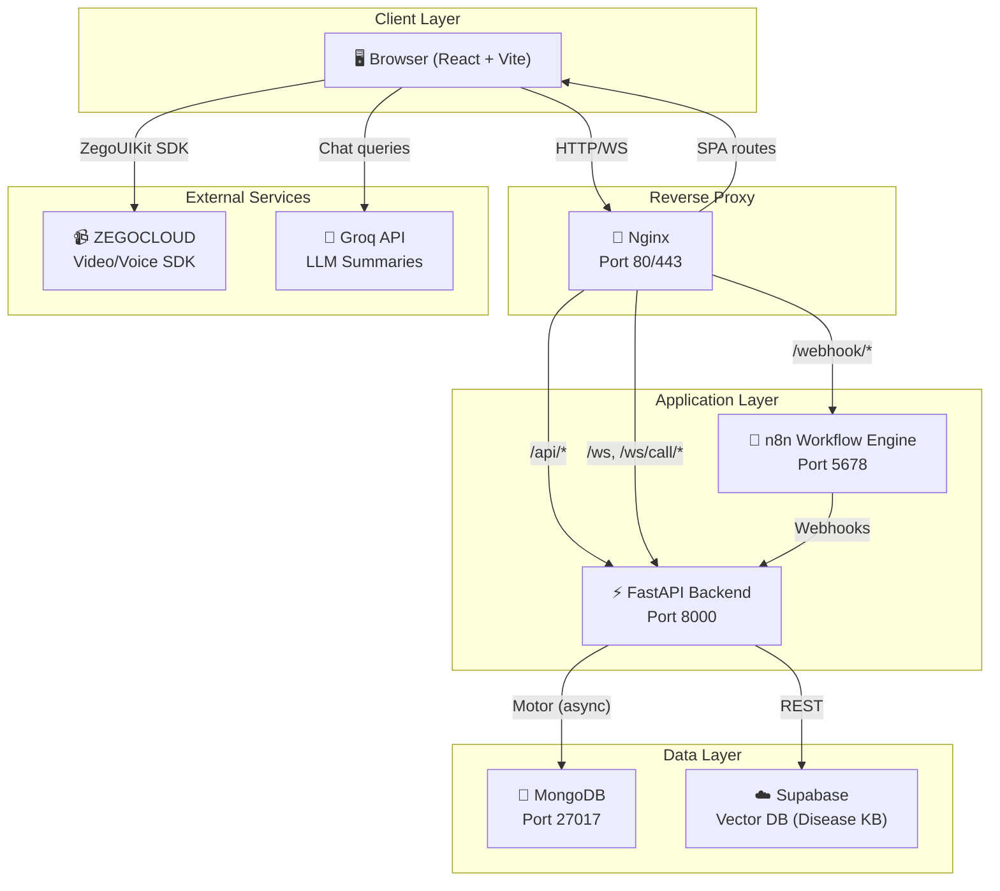

### Architectural Highlights

| Aspect | Design Decision |
|---|---|
| **Frontend ↔ Backend** | Relative URLs; proxied by Vite (dev) or Nginx (prod) |
| **Real-Time** | Two WebSocket endpoints: `/ws` (event broadcast) and `/ws/call/{user_id}` (per-user call signaling) |
| **Offline Fallback** | Frontend includes mock data, simulated WebSocket events, and BroadcastChannel for calls |
| **Data Access** | Generic CRUD service factory — one `CRUDService` class serves all 9+ collections |
| **Authentication** | JWT (HS256) with bcrypt password hashing; optional mock login for offline development |

---

## 3. Technology Stack

### Backend

| Technology | Purpose | Version |
|---|---|---|
| **Python** | Backend language | 3.12 |
| **FastAPI** | Async web framework & WebSocket support | 0.115.6 |
| **Uvicorn** | ASGI server | 0.34.0 |
| **Motor** | Async MongoDB driver | 3.7.0 |
| **PyMongo** | MongoDB operations | 4.10.1 |
| **python-jose** | JWT token creation/validation | 3.3.0 |
| **passlib + bcrypt** | Password hashing | 1.7.4 / 4.2.1 |
| **Pydantic** | Data validation & settings | 2.10.4 |
| **pydantic-settings** | Environment variable loading | 2.7.1 |

### Frontend

| Technology | Purpose | Version |
|---|---|---|
| **React** | UI framework | 19.2.4 |
| **TypeScript** | Type-safe JavaScript | 5.9.3 |
| **Vite** | Build tool & dev server | 8.0.1 |
| **React Router DOM** | Client-side routing | 7.14.0 |
| **Chart.js + react-chartjs-2** | Dashboard visualizations | 4.5.1 / 5.3.1 |
| **Lucide React** | Icon library | 1.7.0 |
| **@zegocloud/zego-uikit-prebuilt** | Video/voice calling | 2.17.3 |

### Infrastructure

| Technology | Purpose |
|---|---|
| **MongoDB** | Primary document database |
| **Supabase** | Vector database for disease KB (pgvector) |
| **n8n** | Workflow automation engine |
| **Docker + Docker Compose** | Containerization & orchestration |
| **Nginx** | Reverse proxy, SSL termination, static hosting |
| **GitHub Actions** | CI/CD pipeline |
| **AWS EC2** | Production hosting |

### AI / ML

| Technology | Purpose |
|---|---|
| **Groq API** | LLM-powered summaries for disease entries (Llama 3) |
| **sentence-transformers** | Local embeddings (all-MiniLM-L6-v2, 384-dim vectors) |
| **Supabase pgvector** | Semantic vector similarity search |

---

## 4. Project Structure

```
Healthpulse/
├── .github/workflows/
│   ├── ci.yml                    # CI pipeline (lint, build, test, docker)
│   └── deploy.yml                # CD pipeline (SSH → EC2 → docker compose)
│
├── healthcare-backend/           # ⚡ FastAPI Backend
│   ├── app/
│   │   ├── __init__.py
│   │   ├── main.py               # Application entry point & route registration
│   │   ├── config.py             # Settings loaded from .env via pydantic-settings
│   │   ├── database.py           # Async MongoDB connection (Motor) with retry
│   │   ├── seed.py               # Auto-seeds all collections with rich demo data
│   │   ├── models/               # Pydantic data models
│   │   │   ├── base.py           #   MongoBaseModel (id, timestamps, to/from_mongo)
│   │   │   ├── user.py           #   UserModel, UserInDB, UserCreate, UserLogin
│   │   │   ├── patient.py        #   PatientModel, PatientCreate, PatientUpdate
│   │   │   ├── doctor.py         #   DoctorModel, DoctorCreate, DoctorUpdate
│   │   │   ├── staff.py          #   StaffModel, StaffCreate, StaffUpdate
│   │   │   ├── department.py     #   DepartmentModel, DepartmentCreate, DepartmentUpdate
│   │   │   ├── appointment.py    #   AppointmentModel, AppointmentCreate, AppointmentUpdate
│   │   │   ├── visit.py          #   PatientVisitModel + VitalsModel sub-document
│   │   │   ├── billing.py        #   BillingModel (amount, discount, tax, total)
│   │   │   ├── prescription.py   #   PrescriptionModel (medications, dosage, duration)
│   │   │   └── notification.py   #   NotificationModel (title, message, type, read)
│   │   ├── routes/               # API endpoints
│   │   │   ├── auth.py           #   /api/auth/* (login, register, logout, validate, me)
│   │   │   ├── collections.py    #   Generic CRUD router factory
│   │   │   ├── dashboard.py      #   /api/dashboard/* (stats, charts)
│   │   │   ├── websocket.py      #   /ws (real-time event broadcasting)
│   │   │   └── signaling.py      #   /ws/call/{user_id} (call signaling)
│   │   └── services/             # Business logic
│   │       ├── auth.py           #   JWT + bcrypt auth service
│   │       └── crud.py           #   Generic CRUDService (get, create, update, delete, search)
│   ├── embed_diseases.py         # Disease KB embedder (Groq + sentence-transformers → Supabase)
│   ├── embedding_server.py       # Optional embedding microservice
│   ├── HealthPulse_Disease_KB.xlsx  # Disease knowledge base spreadsheet
│   ├── requirements.txt          # Python dependencies
│   ├── Dockerfile                # Backend container image
│   └── tests/                    # Test suite
│
├── healthcare-app/               # 🖥️ React Frontend
│   ├── src/
│   │   ├── App.tsx               # Root component, routing, layout
│   │   ├── main.tsx              # Vite entry point
│   │   ├── index.css             # Full design system (120KB+ of CSS)
│   │   ├── pages/                # Page-level components
│   │   │   ├── Landing.tsx       #   Public landing page
│   │   │   ├── Login.tsx         #   Login + Registration form
│   │   │   ├── DashboardHome.tsx #   Role-aware dashboard router
│   │   │   ├── DoctorDashboard.tsx    # Doctor-specific dashboard (57KB)
│   │   │   ├── PatientDashboard.tsx   # Patient-specific dashboard (51KB)
│   │   │   ├── MasterData.tsx    #   Admin: Patients, Doctors, Staff, Departments
│   │   │   ├── TransactionData.tsx    # Admin: Appointments, Visits, Billing, Prescriptions
│   │   │   ├── Telemedicine.tsx  #   Video/voice calling interface
│   │   │   ├── ChatbotPage.tsx   #   AI chatbot full page
│   │   │   ├── Reports.tsx       #   Analytics & reports
│   │   │   ├── Settings.tsx      #   User & system settings
│   │   │   └── HelpCenter.tsx    #   FAQ & documentation
│   │   ├── components/           # Reusable UI components
│   │   │   ├── Sidebar.tsx       #   Navigation sidebar (role-aware menu)
│   │   │   ├── Header.tsx        #   Top header bar with notifications
│   │   │   ├── ChatbotWidget.tsx #   Floating AI chatbot widget (31KB)
│   │   │   ├── ZegoCallRoom.tsx  #   ZEGOCLOUD video call room
│   │   │   ├── IncomingCallPopup.tsx  # Incoming call notification UI
│   │   │   ├── DoctorPatientConsult.tsx # Doctor-patient consult view
│   │   │   ├── LiveEventFeed.tsx #   Real-time event feed display
│   │   │   ├── LivePulse.tsx     #   Animated heartbeat monitor
│   │   │   ├── ConnectionStatus.tsx   # Backend connection indicator
│   │   │   ├── Skeleton.tsx      #   Loading skeleton components
│   │   │   ├── ConfirmDialog.tsx #   Confirmation modal
│   │   │   ├── ToastContainer.tsx#   Toast notification display
│   │   │   └── AnimatedPage.tsx  #   Page transition wrapper
│   │   ├── services/             # Frontend service layer
│   │   │   ├── api.ts            #   HTTP client (fetch-based, with mock fallback)
│   │   │   ├── websocket.ts      #   WebSocket event service (with fallback events)
│   │   │   ├── callService.ts    #   Call signaling WebSocket client
│   │   │   ├── realtimeDb.ts     #   Firebase-style realtime database layer
│   │   │   ├── permissions.ts    #   RBAC permission matrix
│   │   │   └── dbInit.ts         #   Database initialization & cache priming
│   │   ├── context/              # React Context providers
│   │   │   ├── AuthContext.tsx   #   Authentication state management
│   │   │   ├── ThemeContext.tsx  #   Dark/light theme toggle
│   │   │   └── ToastContext.tsx  #   Toast notification queue
│   │   ├── hooks/                # Custom React hooks
│   │   │   ├── useApi.ts         #   API request hook with loading/error states
│   │   │   ├── useRealtimeCollection.ts  # Subscribe to realtime collection data
│   │   │   └── useToast.ts       #   Toast notification hook
│   │   ├── types/index.ts        # TypeScript interfaces for all entities
│   │   ├── data/                 # Static/mock data
│   │   │   ├── mockData.ts       #   Fallback mock data for all collections
│   │   │   └── helpCenterData.ts #   FAQ and help articles
│   │   └── utils/storage.ts      # LocalStorage utilities
│   ├── nginx.conf                # Production Nginx configuration
│   ├── Dockerfile                # Frontend container image
│   ├── vite.config.ts            # Vite build configuration
│   ├── package.json              # Node.js dependencies
│   └── index.html                # HTML entry point
│
├── n8n workflow/                 # 🔧 n8n Workflow Definitions
│   ├── HealthcareApp.json        #   Main healthcare automation workflow
│   └── search_disease_kb.json    #   Disease KB search workflow
│
├── scripts/                      # 🛠️ Deployment Scripts
│   ├── ec2-deploy.sh             #   EC2 deployment automation
│   └── health-check.sh           #   Service health verification
│
├── docker-compose.yml            # Multi-container orchestration
├── docker-compose.aws.yml        # AWS-specific compose overrides
├── deploy-ec2.sh                 # EC2 deployment script
├── init-n8n-workflows.sh         # Auto-import n8n workflows on startup
├── import-n8n-workflows.sh       # Manual n8n workflow import
├── import-n8n-workflows.ps1      # PowerShell variant
├── verify-deployment.ps1         # PowerShell deployment verification
└── .env.aws.example              # Environment variable template
```

---

## 5. Backend — FastAPI

### 5.1 Application Entry Point

**File:** [main.py](file:///c:/Healthpulse/healthcare-backend/app/main.py)

The FastAPI application is created with an async lifespan manager that handles:

1. **Startup:** Connects to MongoDB, seeds the database with demo data, and starts the WebSocket event broadcaster as a background task.
2. **Shutdown:** Cancels the event broadcaster and disconnects from MongoDB.

The app registers five categories of routes:
- **Auth Router** — Authentication endpoints
- **Dashboard Router** — Aggregated statistics and chart data
- **WebSocket Router** — Real-time event broadcasting
- **Signaling Router** — Per-user call signaling
- **Dynamic Collection Routers** — Auto-generated CRUD endpoints for 9 collections (patients, doctors, staff, departments, appointments, visits, billing, prescriptions, notifications)

### 5.2 Configuration

**File:** [config.py](file:///c:/Healthpulse/healthcare-backend/app/config.py)

Uses `pydantic-settings` to load configuration from environment variables and `.env` file:

| Setting | Default | Description |
|---|---|---|
| `APP_NAME` | `HealthPulse Backend` | Application display name |
| `APP_VERSION` | `1.0.0` | Semantic version |
| `MONGODB_URL` | `mongodb://localhost:27017` | MongoDB connection string |
| `MONGODB_DB_NAME` | `healthpulse` | Database name |
| `JWT_SECRET_KEY` | (placeholder) | Secret for JWT signing |
| `JWT_ALGORITHM` | `HS256` | JWT algorithm |
| `JWT_ACCESS_TOKEN_EXPIRE_MINUTES` | `1440` (24h) | Token TTL |
| `CORS_ORIGINS` | localhost variants | Comma-separated allowed origins |
| `LOG_LEVEL` | `INFO` | Logging verbosity |
| `SKIP_DB_CONNECTION` | `False` | Run without MongoDB (dev mode) |
| `groq_api_key` | (empty) | Groq API key for AI features |
| `supabase_url` | (empty) | Supabase project URL |
| `supabase_service_key` | (empty) | Supabase service role key |

### 5.3 Database Layer

**File:** [database.py](file:///c:/Healthpulse/healthcare-backend/app/database.py)

- **Driver:** Motor (async MongoDB driver built on PyMongo)
- **Connection Pool:** 10–50 connections, 5s server selection timeout
- **Retry Logic:** Up to 3 connection attempts with 2-second delay
- **Dev Mode:** Setting `SKIP_DB_CONNECTION=True` allows the backend to start without MongoDB
- **Singleton Pattern:** A global `database` instance is shared across the application
- **Dependency Injection:** `get_database()` provides the database to route handlers

### 5.4 Data Models

All models inherit from [MongoBaseModel](file:///c:/Healthpulse/healthcare-backend/app/models/base.py) which provides:
- `id` — Unique document identifier (mapped to/from MongoDB's `_id`)
- `created_at` / `updated_at` — Automatic timestamps
- `to_mongo()` / `from_mongo()` — Bidirectional conversion methods

Each entity has three model variants:
1. **Model** — Full document representation (e.g., `PatientModel`)
2. **Create** — Input schema for creating new records (e.g., `PatientCreate`)
3. **Update** — Partial update schema with all fields optional (e.g., `PatientUpdate`)

| Model | Key Fields |
|---|---|
| **UserModel** | `username`, `name`, `role` (Admin/Doctor/Staff), `avatar` |
| **UserInDB** | Extends UserModel + `hashed_password` |
| **PatientModel** | `name`, `age`, `gender`, `contact`, `email`, `address`, `bloodGroup`, `registeredDate`, `status` |
| **DoctorModel** | `name`, `specialization`, `contact`, `email`, `experience`, `department`, `availability`, `status` |
| **StaffModel** | `name`, `role`, `department`, `contact`, `email`, `joinDate`, `status` |
| **DepartmentModel** | `name`, `head`, `staffCount`, `location`, `status` |
| **AppointmentModel** | `patientName`, `doctorName`, `department`, `date`, `time`, `status`, `type`, `notes` |
| **PatientVisitModel** | `patientName`, `doctorName`, `visitDate`, `diagnosis`, `treatment`, `followUpDate`, `status`, `vitals` (sub-document: bp, temp, pulse, weight) |
| **BillingModel** | `patientName`, `invoiceDate`, `services`, `amount`, `discount`, `tax`, `total`, `paymentMethod`, `status` |
| **PrescriptionModel** | `patientName`, `doctorName`, `date`, `medications`, `dosage`, `duration`, `instructions`, `status` |
| **NotificationModel** | `title`, `message`, `type` (info/success/warning/error), `time`, `read` |

### 5.5 Services

#### Authentication Service — [auth.py](file:///c:/Healthpulse/healthcare-backend/app/services/auth.py)

| Function | Description |
|---|---|
| `hash_password(password)` | bcrypt hash a plaintext password |
| `verify_password(plain, hashed)` | Verify password against bcrypt hash |
| `create_access_token(data, expires_delta)` | Create a JWT with userId, role, iat, exp |
| `decode_token(token)` | Decode and validate JWT; raises 401 on failure |
| `get_current_user(credentials)` | FastAPI dependency: extract user from JWT Bearer token, fetch full user from DB |
| `get_optional_user(credentials)` | Same as above, but returns `None` instead of raising 401 if no token provided |

#### CRUD Service — [crud.py](file:///c:/Healthpulse/healthcare-backend/app/services/crud.py)

A generic, reusable async CRUD service for any MongoDB collection:

| Method | Description |
|---|---|
| `get_all(page, page_size, sort_field, sort_order, filters)` | Paginated list with total count |
| `get_by_id(doc_id)` | Single document by `_id` |
| `create(data)` | Insert with auto-generated sequential ID (e.g., `P001`, `D001`, `APT001`) |
| `update(doc_id, updates)` | Partial update via `$set` |
| `delete(doc_id)` | Delete by `_id` |
| `search(query, fields)` | Regex-based text search across all string fields |
| `count(filters)` | Count matching documents |
| `_generate_id()` | Generates prefixed sequential IDs (P, D, S, DEP, APT, V, B, RX, N) |

### 5.6 API Routes

#### Auth Routes — [auth.py](file:///c:/Healthpulse/healthcare-backend/app/routes/auth.py) — `/api/auth`

| Method | Endpoint | Auth | Description |
|---|---|---|---|
| POST | `/api/auth/login` | ❌ | Authenticate with username/password → JWT token |
| POST | `/api/auth/register` | ❌ | Patient self-registration (creates user + patient record) |
| POST | `/api/auth/logout` | ✅ | Logout (server-side log) |
| GET | `/api/auth/validate` | ✅ | Validate current JWT token |
| GET | `/api/auth/me` | ✅ | Get authenticated user profile |
| GET | `/api/auth/login-history` | ✅ | Get recent login logs (last 20) |

#### Dashboard Routes — [dashboard.py](file:///c:/Healthpulse/healthcare-backend/app/routes/dashboard.py) — `/api/dashboard`

| Method | Endpoint | Auth | Description |
|---|---|---|---|
| GET | `/api/dashboard/stats` | ✅ | Aggregated stats (total patients, doctors, revenue, etc.) |
| GET | `/api/dashboard/charts` | ✅ | Chart data (daily patients, revenue, department visits) |

#### Collection CRUD Routes — [collections.py](file:///c:/Healthpulse/healthcare-backend/app/routes/collections.py) — `/api/{collection}`

Auto-generated for 9 collections: `patients`, `doctors`, `staff`, `departments`, `appointments`, `visits`, `billing`, `prescriptions`, `notifications`.

| Method | Endpoint | Auth | Description |
|---|---|---|---|
| GET | `/api/{collection}` | Optional | Paginated list (supports `page`, `pageSize` query params) |
| GET | `/api/{collection}/search?q=` | Optional | Text search across all string fields |
| GET | `/api/{collection}/{id}` | Optional | Get single item by ID |
| POST | `/api/{collection}` | ✅ Required | Create new item |
| PUT | `/api/{collection}/{id}` | ✅ Required | Update existing item |
| DELETE | `/api/{collection}/{id}` | ✅ Required | Delete item |

> **Note:** Read endpoints use optional auth (`get_optional_user`) to support both authenticated and unauthenticated access. Write endpoints require a valid JWT.

#### Health Check Routes

| Method | Endpoint | Description |
|---|---|---|
| GET | `/` | Basic health check (name, version, status) |
| GET | `/api/health` | Detailed health check with MongoDB connectivity status |

### 5.7 Database Seeding

**File:** [seed.py](file:///c:/Healthpulse/healthcare-backend/app/seed.py)

On startup, if collections are empty, the seeder populates them with realistic demo data:

| Collection | Records | Example IDs |
|---|---|---|
| `users` | 14 | U001–U014 (1 Admin, 12 Doctors, 1 Staff) |
| `patients` | 20 | P001–P020 |
| `doctors` | 12 | D001–D012 |
| `staff` | 10 | S001–S010 |
| `departments` | 10 | DEP001–DEP010 |
| `appointments` | 15 | APT001–APT015 |
| `visits` | 10 | V001–V010 |
| `billing` | 10 | B001–B010 |
| `prescriptions` | 10 | RX001–RX010 |
| `notifications` | 8 | N001–N008 |

All data uses realistic Indian names, addresses, medical terminology, and clinically accurate prescriptions.

---

## 6. Frontend — React + TypeScript

### 6.1 Application Shell

**File:** [App.tsx](file:///c:/Healthpulse/healthcare-app/src/App.tsx)

The application wraps all components in three context providers:

```
BrowserRouter
  └── ThemeProvider (dark/light mode)
       └── AuthProvider (user session state)
            └── ToastProvider (notification queue)
                 └── AppLoader → AppRoutes
```

**AppLoader** shows an animated loading screen while validating the session token on mount.

**DashboardLayout** provides the authenticated shell:
- Collapsible sidebar navigation
- Top header bar with notifications
- Floating chatbot widget
- Incoming call popup handler
- ZegoCallRoom overlay (renders when a call is accepted)

### 6.2 Pages

| Page | File | Description |
|---|---|---|
| **Landing** | [Landing.tsx](file:///c:/Healthpulse/healthcare-app/src/pages/Landing.tsx) | Public marketing page with features, hero section |
| **Login** | [Login.tsx](file:///c:/Healthpulse/healthcare-app/src/pages/Login.tsx) | Login form + patient registration form (30KB — rich UI) |
| **DashboardHome** | [DashboardHome.tsx](file:///c:/Healthpulse/healthcare-app/src/pages/DashboardHome.tsx) | Role-aware router: renders DoctorDashboard / PatientDashboard / AdminDashboard |
| **DoctorDashboard** | [DoctorDashboard.tsx](file:///c:/Healthpulse/healthcare-app/src/pages/DoctorDashboard.tsx) | Doctor's tabbed interface (57KB): My Patients, Appointments, Prescriptions, Schedule, Quick Actions |
| **PatientDashboard** | [PatientDashboard.tsx](file:///c:/Healthpulse/healthcare-app/src/pages/PatientDashboard.tsx) | Patient portal (51KB): Book Appointments, Medical Records, Prescriptions, Notifications, Doctor Directory |
| **MasterData** | [MasterData.tsx](file:///c:/Healthpulse/healthcare-app/src/pages/MasterData.tsx) | Admin CRUD for Patients, Doctors, Staff, Departments (tabbed, with search/create/edit/delete) |
| **TransactionData** | [TransactionData.tsx](file:///c:/Healthpulse/healthcare-app/src/pages/TransactionData.tsx) | Admin CRUD for Appointments, Visits, Billing, Prescriptions |
| **Telemedicine** | [Telemedicine.tsx](file:///c:/Healthpulse/healthcare-app/src/pages/Telemedicine.tsx) | Video/voice call interface with doctor selection and ZEGOCLOUD integration |
| **ChatbotPage** | [ChatbotPage.tsx](file:///c:/Healthpulse/healthcare-app/src/pages/ChatbotPage.tsx) | Full-page chatbot experience |
| **Reports** | [Reports.tsx](file:///c:/Healthpulse/healthcare-app/src/pages/Reports.tsx) | Charts and analytics dashboards |
| **Settings** | [Settings.tsx](file:///c:/Healthpulse/healthcare-app/src/pages/Settings.tsx) | Profile, preferences, security, and system settings |
| **HelpCenter** | [HelpCenter.tsx](file:///c:/Healthpulse/healthcare-app/src/pages/HelpCenter.tsx) | FAQ, guides, and help articles |

### Route Configuration

```
/                       → Landing (or redirect to /dashboard if authenticated)
/login                  → Login (or redirect to /dashboard if authenticated)
/dashboard              → ProtectedRoute → DashboardLayout
  ├── /                 → DashboardHome (role-aware)
  ├── /chatbot          → ChatbotPage
  ├── /telemedicine     → Telemedicine
  ├── /reports          → Reports
  ├── /settings         → Settings
  ├── /help-center      → HelpCenter
  ├── /master-data      → MasterData (Admin/Staff/Doctor only)
  └── /transaction-data → TransactionData (Admin/Staff/Doctor only)
```

### 6.3 Components

| Component | File | Description |
|---|---|---|
| **Sidebar** | [Sidebar.tsx](file:///c:/Healthpulse/healthcare-app/src/components/Sidebar.tsx) | Role-aware navigation with collapse/expand, mobile drawer |
| **Header** | [Header.tsx](file:///c:/Healthpulse/healthcare-app/src/components/Header.tsx) | Top bar with breadcrumbs, search, notifications bell, user avatar |
| **ChatbotWidget** | [ChatbotWidget.tsx](file:///c:/Healthpulse/healthcare-app/src/components/ChatbotWidget.tsx) | Floating chatbot bubble (31KB): message history, quick actions, AI responses |
| **ZegoCallRoom** | [ZegoCallRoom.tsx](file:///c:/Healthpulse/healthcare-app/src/components/ZegoCallRoom.tsx) | Full-screen video/voice call room using ZEGOCLOUD UIKit |
| **IncomingCallPopup** | [IncomingCallPopup.tsx](file:///c:/Healthpulse/healthcare-app/src/components/IncomingCallPopup.tsx) | Animated incoming call popup with accept/reject buttons |
| **DoctorPatientConsult** | [DoctorPatientConsult.tsx](file:///c:/Healthpulse/healthcare-app/src/components/DoctorPatientConsult.tsx) | Split-screen doctor-patient consultation view |
| **LiveEventFeed** | [LiveEventFeed.tsx](file:///c:/Healthpulse/healthcare-app/src/components/LiveEventFeed.tsx) | Real-time scrolling event feed from WebSocket |
| **LivePulse** | [LivePulse.tsx](file:///c:/Healthpulse/healthcare-app/src/components/LivePulse.tsx) | Animated heartbeat monitor (ECG-style) |
| **ConnectionStatus** | [ConnectionStatus.tsx](file:///c:/Healthpulse/healthcare-app/src/components/ConnectionStatus.tsx) | Visual indicator of backend connection status |
| **Skeleton** | [Skeleton.tsx](file:///c:/Healthpulse/healthcare-app/src/components/Skeleton.tsx) | Loading placeholder animations |
| **ConfirmDialog** | [ConfirmDialog.tsx](file:///c:/Healthpulse/healthcare-app/src/components/ConfirmDialog.tsx) | Confirmation modal for destructive actions |
| **ToastContainer** | [ToastContainer.tsx](file:///c:/Healthpulse/healthcare-app/src/components/ToastContainer.tsx) | Stacked toast notification display |
| **AnimatedPage** | [AnimatedPage.tsx](file:///c:/Healthpulse/healthcare-app/src/components/AnimatedPage.tsx) | CSS transition wrapper for page changes |

### 6.4 Services Layer

#### API Service — [api.ts](file:///c:/Healthpulse/healthcare-app/src/services/api.ts)

A singleton `ApiService` class providing:
- **Core HTTP methods** with automatic JWT Bearer token injection
- **Request logging** (last 100 requests with timing)
- **Error handling** with structured `ApiError` objects
- **Mock login fallback** with a built-in credentials table for 16 users (1 admin, 12 doctors, 1 staff, 1 patient)
- **CRUD methods:** `getAll`, `getById`, `create`, `update`, `delete`, `search`
- **Auth methods:** `login`, `logout`, `validateToken`, `register`
- **Dashboard methods:** `getDashboardStats`, `getDashboardCharts`
- **Health check:** `checkHealth`

#### WebSocket Service — [websocket.ts](file:///c:/Healthpulse/healthcare-app/src/services/websocket.ts)

Connects to `/ws` for real-time event broadcasting:
- **Auto-reconnect** with exponential backoff (max 10 attempts)
- **Fallback mode** — simulates events when backend is unreachable
- **Heartbeat** — simulated BPM data at 1Hz for LivePulse component
- **Event types:** `patient_alert`, `appointment_update`, `vital_update`, `billing_event`, `system_event`, `staff_status`
- **Severities:** `info`, `warning`, `critical`, `success`
- **Subscriber API:** `onEvent(handler)`, `on(type, handler)`, `onHeartbeat(handler)`

#### Call Service — [callService.ts](file:///c:/Healthpulse/healthcare-app/src/services/callService.ts)

Manages call signaling via `/ws/call/{user_id}`:
- **Per-user WebSocket** — each user gets their own signaling channel
- **Call lifecycle:** `initiateCall` → `ringing` → `accepted`/`rejected`/`missed` → `ended`
- **Auto-timeout** — 45 seconds for unanswered calls
- **BroadcastChannel fallback** — for same-browser tab-to-tab calls
- **Zego Room ID passing** — caller generates a `zegoRoomID` that is sent via the signal so the receiver joins the same ZEGOCLOUD room

#### Realtime Database — [realtimeDb.ts](file:///c:/Healthpulse/healthcare-app/src/services/realtimeDb.ts)

A Firebase-style reactive data layer:
- **`onSnapshot(collection, listener)`** — Subscribe to a collection; receives initial data + all changes
- **Optimistic updates** — UI updates immediately, then syncs with backend (rollback on failure)
- **Offline queue** — Failed operations are queued and retried when connectivity returns
- **Polling** — Collections are refreshed every 12 seconds from the backend API
- **Presence tracking** — Track active users and their current page (30s timeout)
- **Change log** — Maintains last 200 data change events

#### Permissions Service — [permissions.ts](file:///c:/Healthpulse/healthcare-app/src/services/permissions.ts)

Comprehensive RBAC system (detailed in [Section 6.7](#67-role-based-permissions)).

### 6.5 Context Providers

| Context | File | State Managed |
|---|---|---|
| **AuthContext** | [AuthContext.tsx](file:///c:/Healthpulse/healthcare-app/src/context/AuthContext.tsx) | `user`, `session`, `login()`, `register()`, `logout()`, `isAuthenticated`, `isLoading`, `loginHistory`, `sessionTimeRemaining` |
| **ThemeContext** | [ThemeContext.tsx](file:///c:/Healthpulse/healthcare-app/src/context/ThemeContext.tsx) | `theme` (dark/light), `toggleTheme()` |
| **ToastContext** | [ToastContext.tsx](file:///c:/Healthpulse/healthcare-app/src/context/ToastContext.tsx) | Toast notification queue, `addToast()`, `removeToast()` |

The **AuthContext** validates sessions on mount by calling `api.validateToken()`. It maintains a 1-second interval timer that auto-logs out users when their JWT expires.

### 6.6 Custom Hooks

| Hook | File | Description |
|---|---|---|
| `useApi` | [useApi.ts](file:///c:/Healthpulse/healthcare-app/src/hooks/useApi.ts) | Generic API request hook with `loading`, `error`, `data` states |
| `useRealtimeCollection` | [useRealtimeCollection.ts](file:///c:/Healthpulse/healthcare-app/src/hooks/useRealtimeCollection.ts) | Subscribe to a realtime database collection; returns live data array |
| `useToast` | [useToast.ts](file:///c:/Healthpulse/healthcare-app/src/hooks/useToast.ts) | Toast notification hook: `showSuccess()`, `showError()`, `showWarning()`, `showInfo()` |

### 6.7 Role-Based Permissions

**File:** [permissions.ts](file:///c:/Healthpulse/healthcare-app/src/services/permissions.ts)

Four roles with granular feature-level and data-level permissions:

| Resource | Admin | Doctor | Staff | Patient |
|---|---|---|---|---|
| Dashboard | FULL | READ | READ | READ |
| Patients | FULL | WRITE | WRITE | NONE |
| Doctors | FULL | READ | READ | READ |
| Staff | FULL | READ | READ | NONE |
| Departments | FULL | READ | READ | NONE |
| Appointments | FULL | WRITE | WRITE | NONE |
| Visits | WRITE | WRITE | READ | NONE |
| Billing | FULL | READ | CREATE | READ |
| Prescriptions | FULL | WRITE | READ | READ |
| Reports | READ | READ | NONE | NONE |
| Settings | FULL | EDIT | EDIT | EDIT |
| Telemedicine | WRITE | WRITE | NONE | CREATE |
| Chatbot | WRITE | WRITE | WRITE | WRITE |
| Own Records | READ | READ | NONE | READ |
| Book Appointment | FULL | CREATE | NONE | CREATE |
| Notifications | READ | READ | READ | READ |

> **FULL** = view + create + edit + delete  
> **WRITE** = view + create + edit  
> **READ** = view only  
> **CREATE** = view + create  
> **EDIT** = view + edit  
> **NONE** = no access

The system also includes:
- **`canAccessRecord()`** — Data-level security (patients can only see their own records)
- **`getAllowedRoutes()`** — Returns permitted routes per role
- **`SecurityAuditLogger`** — Client-side audit logging with 17 action types

### 6.8 Type System

**File:** [types/index.ts](file:///c:/Healthpulse/healthcare-app/src/types/index.ts)

TypeScript interfaces for all domain entities: `Patient`, `Doctor`, `Staff`, `Department`, `Appointment`, `PatientVisit`, `Billing`, `Prescription`, `User`, `ChatMessage`, `Notification`.

---

## 7. Database Schema

**Database:** MongoDB (document-oriented, schema-less)  
**Database Name:** `healthpulse`

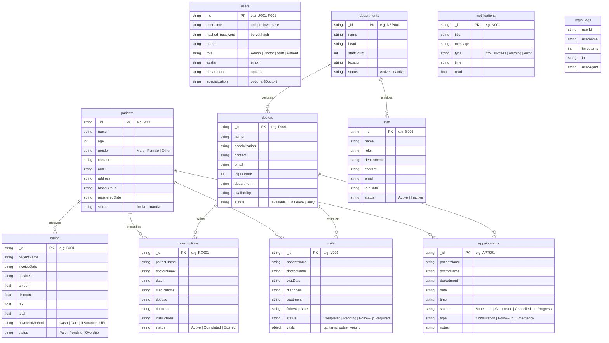

### Additional Collections

| Collection | Purpose |
|---|---|
| `login_logs` | Tracks every successful login with userId, username, timestamp, IP |
| `disease_kb` (Supabase) | Vector-indexed disease knowledge base for semantic search |

---

## 8. API Reference

### Standardized Response Format

All API endpoints return responses in a consistent envelope:

```json
{
  "data": { ... },
  "status": 200,
  "message": "Success",
  "timestamp": 1718000000000,
  "requestId": "req_1718000000"
}
```

### Complete Endpoint List

| # | Method | Path | Auth | Description |
|---|---|---|---|---|
| 1 | GET | `/` | ❌ | Health check |
| 2 | GET | `/api/health` | ❌ | Detailed health + DB status |
| 3 | POST | `/api/auth/login` | ❌ | Login → JWT token |
| 4 | POST | `/api/auth/register` | ❌ | Patient self-registration |
| 5 | POST | `/api/auth/logout` | ✅ | Logout |
| 6 | GET | `/api/auth/validate` | ✅ | Validate token |
| 7 | GET | `/api/auth/me` | ✅ | Current user profile |
| 8 | GET | `/api/auth/login-history` | ✅ | Recent logins |
| 9 | GET | `/api/dashboard/stats` | ✅ | Dashboard statistics |
| 10 | GET | `/api/dashboard/charts` | ✅ | Chart data |
| 11–16 | CRUD | `/api/patients` | Mixed | Patient CRUD + search |
| 17–22 | CRUD | `/api/doctors` | Mixed | Doctor CRUD + search |
| 23–28 | CRUD | `/api/staff` | Mixed | Staff CRUD + search |
| 29–34 | CRUD | `/api/departments` | Mixed | Department CRUD + search |
| 35–40 | CRUD | `/api/appointments` | Mixed | Appointment CRUD + search |
| 41–46 | CRUD | `/api/visits` | Mixed | Visit CRUD + search |
| 47–52 | CRUD | `/api/billing` | Mixed | Billing CRUD + search |
| 53–58 | CRUD | `/api/prescriptions` | Mixed | Prescription CRUD + search |
| 59–64 | CRUD | `/api/notifications` | Mixed | Notification CRUD + search |
| 65 | GET | `/api/call/online` | ❌ | List online users (debug) |
| 66 | WS | `/ws` | ❌ | Event broadcasting WebSocket |
| 67 | WS | `/ws/call/{user_id}` | ❌ | Per-user call signaling WebSocket |

**Total: 67 endpoints** (54 REST + 2 WebSocket + health checks)

---

## 9. Real-Time Systems

### 9.1 WebSocket Event Broadcasting

**Backend:** [websocket.py](file:///c:/Healthpulse/healthcare-backend/app/routes/websocket.py)  
**Frontend:** [websocket.ts](file:///c:/Healthpulse/healthcare-app/src/services/websocket.ts)

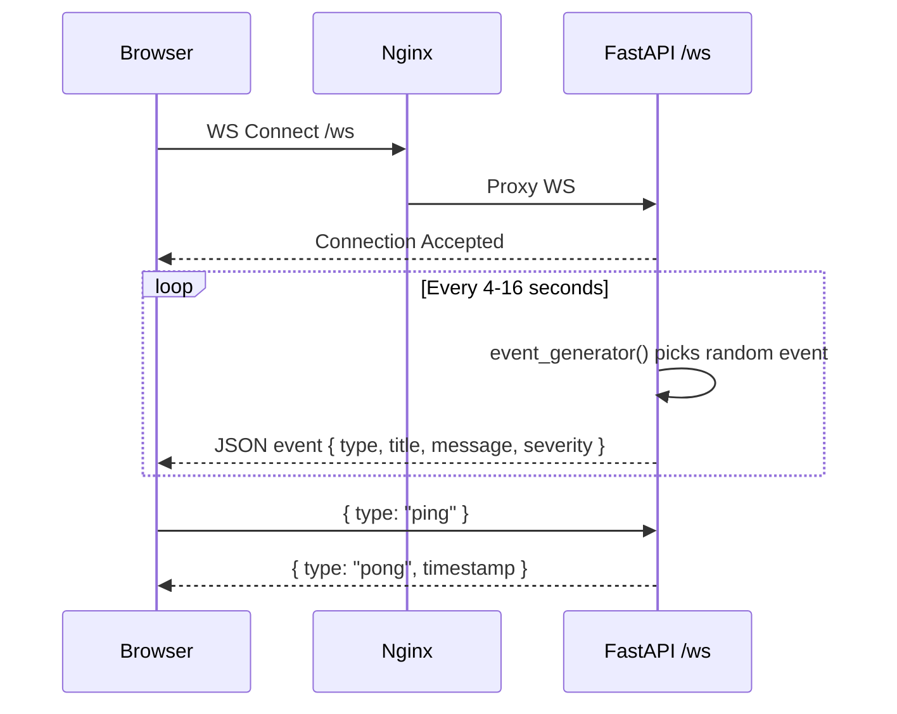

**15 event templates** covering: vital updates, appointment updates, patient alerts, billing events, system events, staff status changes — each with severity levels.

### 9.2 Call Signaling

**Backend:** [signaling.py](file:///c:/Healthpulse/healthcare-backend/app/routes/signaling.py)  
**Frontend:** [callService.ts](file:///c:/Healthpulse/healthcare-app/src/services/callService.ts)

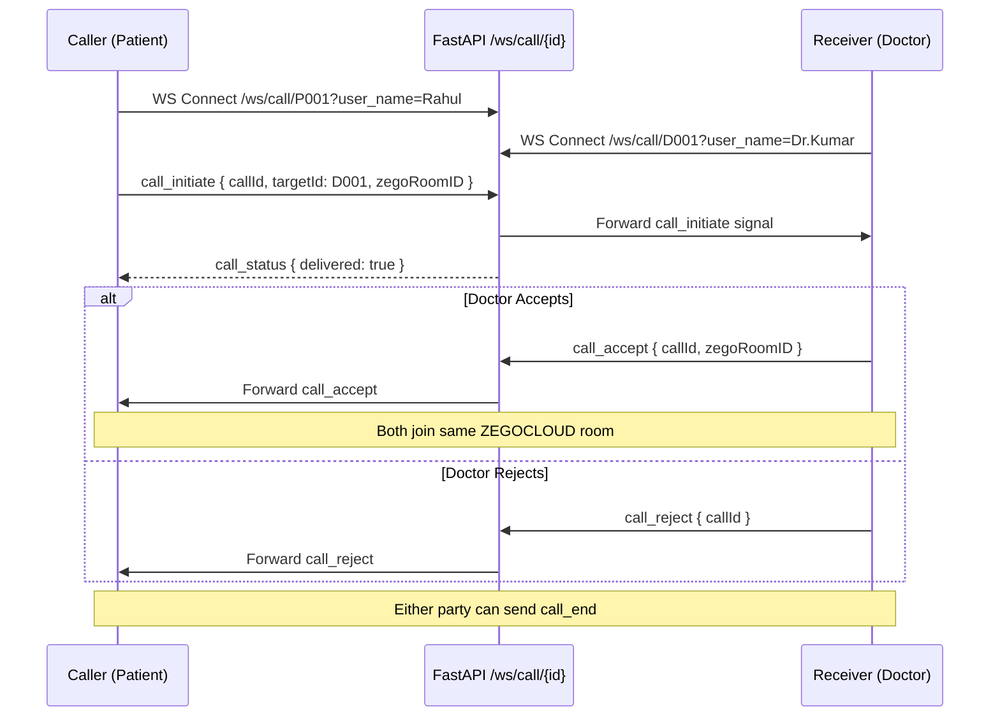

The **SignalingManager** maintains a registry of `user_id → WebSocket` mappings and routes messages directly between users by ID.

### 9.3 Realtime Database Layer

**File:** [realtimeDb.ts](file:///c:/Healthpulse/healthcare-app/src/services/realtimeDb.ts)

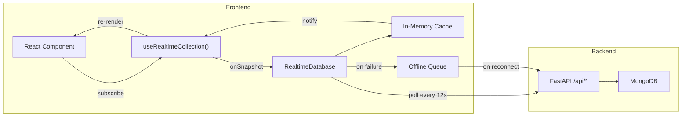

---

## 10. Telemedicine & Video Calling

The telemedicine system consists of three layers:

### 1. Call Signaling (Custom WebSocket)
- Caller generates a unique `zegoRoomID` and sends it via the signaling server
- Receiver gets the `zegoRoomID` through the incoming call popup
- Both parties know which ZEGOCLOUD room to join

### 2. Video/Voice Infrastructure (ZEGOCLOUD)
- Uses `@zegocloud/zego-uikit-prebuilt` SDK
- Supports one-on-one video and voice calls
- Room-based architecture — both parties join the same `roomID`
- Features: screen sharing, camera toggle, microphone toggle, picture-in-picture

### 3. UI Components
- **Telemedicine Page** — Doctor selection, call initiation
- **ZegoCallRoom** — Full-screen call interface
- **IncomingCallPopup** — Animated popup for incoming calls
- **DoctorPatientConsult** — Split-screen consultation view

---

## 11. AI Chatbot & Disease Knowledge Base

### Architecture

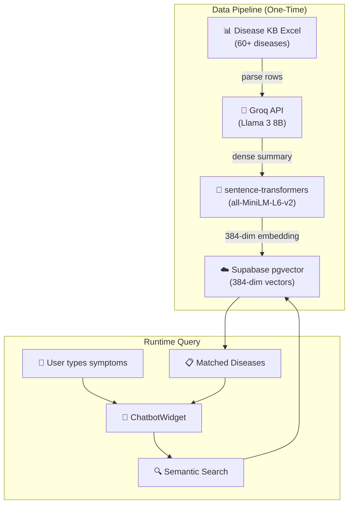

### Data Pipeline

**File:** [embed_diseases.py](file:///c:/Healthpulse/healthcare-backend/embed_diseases.py)

1. **Parse** — Reads diseases from `HealthPulse_Disease_KB.xlsx` (columns: disease, category, symptoms, severity, red flags, home care, OTC meds, see-doctor-if, specialist, contagious, notes)
2. **Summarize** — Each disease entry is sent to **Groq API** (Llama 3 8B) to generate a dense natural-language summary optimized for semantic search
3. **Embed** — Summaries are encoded into **384-dimensional vectors** using `sentence-transformers` (all-MiniLM-L6-v2) locally — zero cost
4. **Store** — Vectors + metadata are inserted into **Supabase** `disease_kb` table with pgvector indexing

### n8n Integration

A dedicated n8n workflow (`search_disease_kb.json`) exposes a webhook endpoint that the chatbot calls to perform semantic vector search against the disease KB.

---

## 12. Workflow Automation — n8n

**Container:** `healthpulse-n8n` (n8nio/n8n:latest)

### Workflow Definitions

| File | Purpose |
|---|---|
| `HealthcareApp.json` | Main healthcare workflow: appointment reminders, notification dispatch, data sync |
| `search_disease_kb.json` | Disease KB semantic search via Supabase vector similarity |

### Auto-Import

On container startup, `init-n8n-workflows.sh` automatically imports workflow JSON files into n8n via CLI, ensuring workflows are always up-to-date with the repository.

### Integration Points

- **Webhook endpoints** proxied through Nginx at `/webhook/*`
- **Backend communication** via REST API calls to `backend:8000`
- **AI integration** via Anthropic API key for Claude-powered workflows
- **Supabase** connection for disease KB queries

---

## 13. Authentication & Security

### Authentication Flow

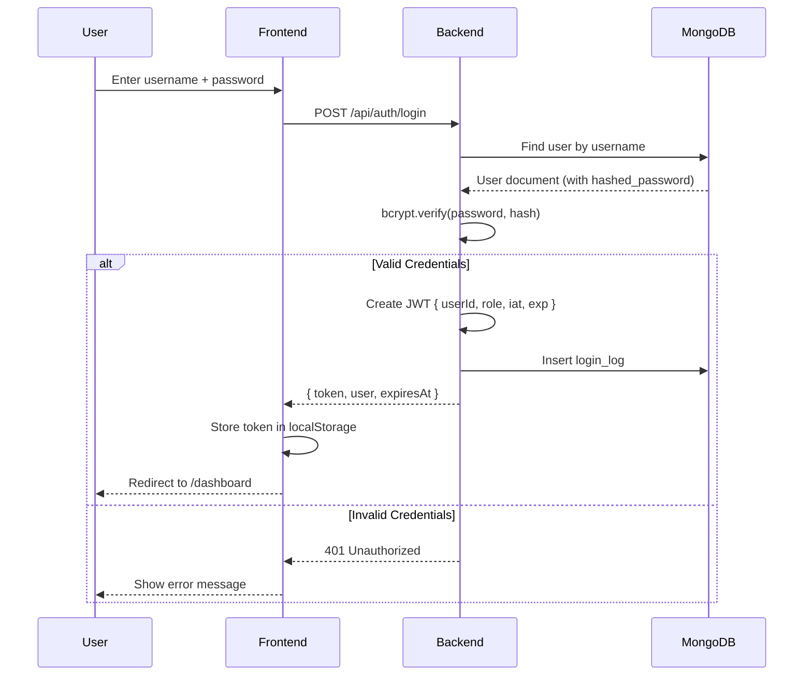

### Security Features

| Feature | Implementation |
|---|---|
| **Password Hashing** | bcrypt with auto-salt (passlib) |
| **JWT Tokens** | HS256 algorithm, 24-hour expiry |
| **Token Validation** | Decoded and verified on every protected request |
| **CORS** | Whitelist of allowed origins (configurable via env) |
| **Optional Auth** | Read endpoints work without tokens for flexibility |
| **Mock Login** | 16 built-in user accounts for offline development |
| **Session Timer** | Frontend auto-logout when token expires |
| **Audit Logging** | Client-side SecurityAuditLogger with 17 action types |
| **Security Headers** | Nginx adds X-Frame-Options, X-Content-Type-Options, Referrer-Policy |
| **SSL/TLS** | Nginx supports HTTPS with configurable certificates |

### Default Credentials

| Username | Password | Role |
|---|---|---|
| `admin` | `admin123` | Admin |
| `doctor` / `rajesh` / `priya` / ... | `doctor123` | Doctor (12 accounts) |
| `staff` | `staff123` | Staff |
| `patient` | `patient123` | Patient |

---

## 14. Deployment & DevOps

### 14.1 Docker Compose

**File:** [docker-compose.yml](file:///c:/Healthpulse/docker-compose.yml)

Four containers orchestrated:

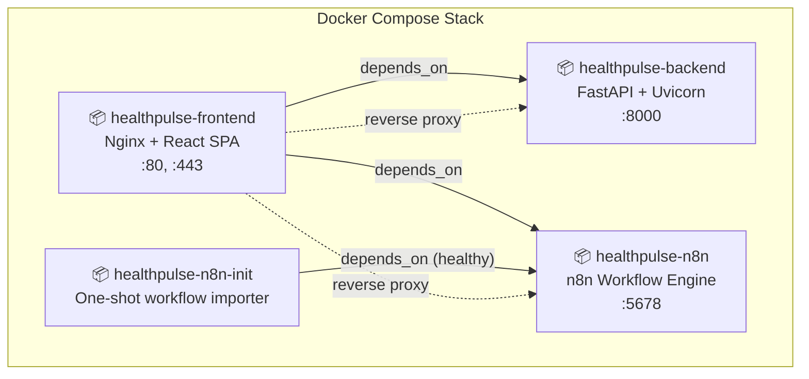

| Service | Image | Ports | Health Check |
|---|---|---|---|
| **backend** | Custom (Dockerfile) | 8000 | `GET /api/health` every 15s |
| **frontend** | Custom (Dockerfile) | 80, 443 | — |
| **n8n** | n8nio/n8n:latest | 5678 | `GET /healthz` every 10s |
| **n8n-init** | n8nio/n8n:latest | — | One-shot, then exits |

### 14.2 Nginx Reverse Proxy

**File:** [nginx.conf](file:///c:/Healthpulse/healthcare-app/nginx.conf)

| Path | Proxy Target | Notes |
|---|---|---|
| `/api/*` | `backend:8000/api/` | REST API |
| `/ws` | `backend:8000/ws` | WebSocket (86400s timeout) |
| `/ws/call/*` | `backend:8000/ws/call/` | Call signaling (86400s timeout) |
| `/webhook/*` | `n8n:5678/webhook/` | n8n webhooks |
| `/assets/*` | Static files | 1-year cache |
| `/*` | `index.html` | SPA fallback |

Additional features: gzip compression, SSL support (TLS 1.2/1.3), security headers.

### 14.3 CI/CD Pipeline

#### CI — [ci.yml](file:///c:/Healthpulse/.github/workflows/ci.yml)

Runs on every push and pull request:

| Job | Type | Description |
|---|---|---|
| **Lint Backend** | Advisory | flake8 Python linting |
| **Lint Frontend** | Advisory | ESLint TypeScript linting |
| **Build Frontend** | Hard gate | Vite + TypeScript build, verify dist/ output |
| **Test Backend** | Hard gate | pytest with dummy env vars |
| **Docker Build** | Hard gate | Build both Docker images as smoke test |

> Advisory jobs report issues but never block deployment.

#### CD — [deploy.yml](file:///c:/Healthpulse/.github/workflows/deploy.yml)

Triggered on push to `main` (after CI passes):

1. **SSH into EC2** using GitHub Secrets
2. **Pull latest code** (`git fetch + reset --hard`)
3. **Sync `.env`** files to backend directory
4. **Rebuild containers** (`docker compose up --build -d`)
5. **Health checks** with 10 retries for backend, frontend, and n8n
6. **Cleanup** old Docker images

### 14.4 AWS EC2 Deployment

Production deployment on AWS EC2 with:
- SSH-based deployment via GitHub Actions
- Docker Compose for container orchestration
- Health checks with automatic retry
- Deployment summary in GitHub Step Summary
- Additional deploy scripts in `/scripts/`

---

## 15. Data Flow Diagrams

### Patient Appointment Booking Flow

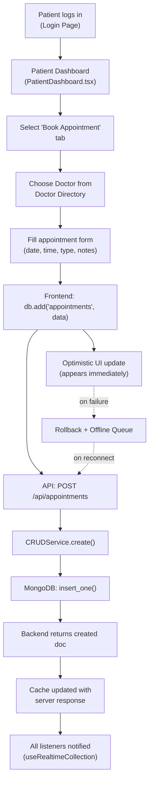

### Admin Data Management Flow

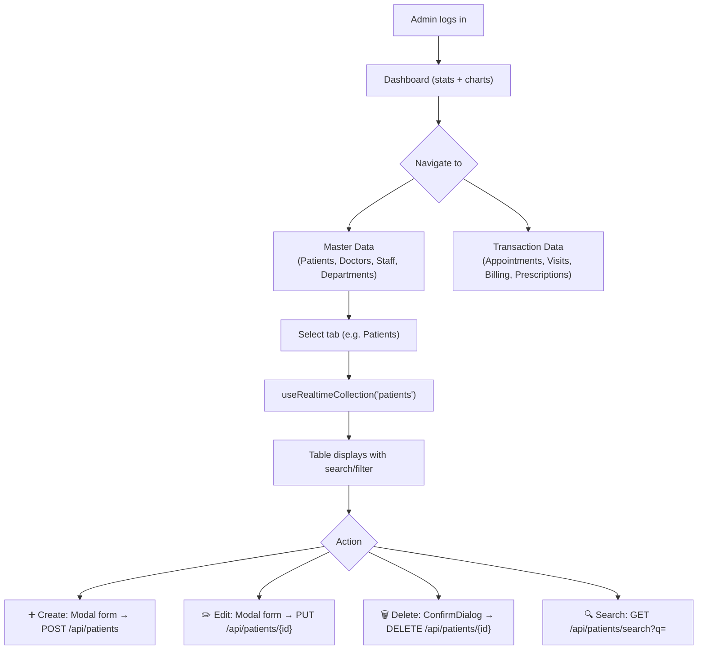

### Telemedicine Call Flow

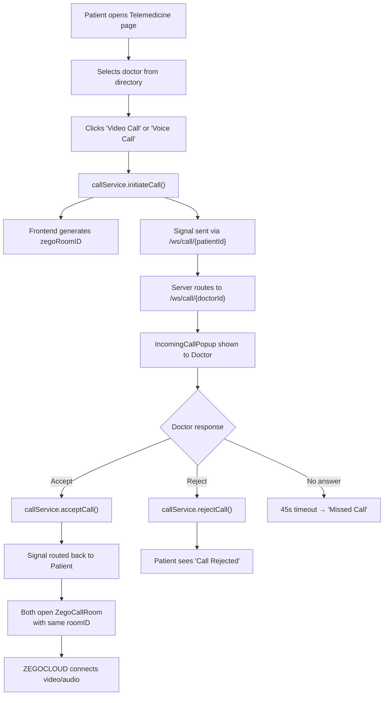

---

## 16. User Workflows

### Admin Workflow

1. **Login** → Admin dashboard with aggregate stats (total patients, revenue, active doctors, occupancy)
2. **Master Data** → CRUD management for Patients, Doctors, Staff, Departments
3. **Transaction Data** → CRUD management for Appointments, Visits, Billing, Prescriptions
4. **Reports** → View analytics charts (daily patients, revenue trends, department visits)
5. **Settings** → System configuration, user management
6. **Real-time monitoring** → Live event feed, connection status, heartbeat pulse

### Doctor Workflow

1. **Login** → Doctor dashboard with personal stats
2. **My Patients** → View assigned patients, medical histories
3. **Appointments** → View/manage upcoming and past appointments
4. **Prescriptions** → Write and manage prescriptions with medications, dosage, instructions
5. **Telemedicine** → Accept incoming video/voice calls from patients
6. **Chatbot** → Use AI assistant for symptom lookup and clinical reference

### Patient Workflow

1. **Register/Login** → Self-registration or login to patient portal
2. **Dashboard** → View upcoming appointments, recent prescriptions, health summary
3. **Book Appointment** → Browse doctor directory, select doctor, book appointment
4. **Medical Records** → View visit history, diagnoses, vitals
5. **Prescriptions** → View active prescriptions, medications, instructions
6. **Telemedicine** → Initiate video/voice call with assigned doctor
7. **Chatbot** → Describe symptoms, get AI-powered health guidance
8. **Notifications** → View alerts, appointment reminders, billing updates

### Staff Workflow

1. **Login** → Staff dashboard with operational stats
2. **Patient Registration** → Register new patients, manage records
3. **Appointment Management** → Schedule, reschedule, cancel appointments
4. **Billing** → Create billing records, process payments
5. **Chatbot** → Use AI assistant for operational queries

---

## 17. Environment Variables

### Backend (.env)

| Variable | Required | Description |
|---|---|---|
| `MONGODB_URL` | ✅ | MongoDB connection string |
| `MONGODB_DB_NAME` | ✅ | Database name (default: `healthpulse`) |
| `JWT_SECRET_KEY` | ✅ | Secret for JWT token signing |
| `JWT_ALGORITHM` | ❌ | Default: `HS256` |
| `JWT_ACCESS_TOKEN_EXPIRE_MINUTES` | ❌ | Default: `1440` (24 hours) |
| `CORS_ORIGINS` | ❌ | Comma-separated allowed origins |
| `LOG_LEVEL` | ❌ | Default: `INFO` |
| `SKIP_DB_CONNECTION` | ❌ | Skip MongoDB (dev mode) |
| `groq_api_key` | ❌ | For AI chatbot features |
| `supabase_url` | ❌ | Supabase project URL |
| `supabase_service_key` | ❌ | Supabase service role key |

### Docker / Deployment

| Variable | Description |
|---|---|
| `EC2_PUBLIC_IP` | Public IP of EC2 instance |
| `N8N_PROTOCOL` | `http` or `https` |
| `N8N_EDITOR_BASE_URL` | n8n editor URL |
| `WEBHOOK_TUNNEL_URL` | n8n webhook URL |
| `ANTHROPIC_API_KEY` | Claude API key for n8n AI workflows |
| `SUPABASE_SECRET_KEY` | Supabase key for n8n |

---

## 18. Getting Started

### Prerequisites

- **Node.js** 22+
- **Python** 3.12+
- **MongoDB** (local or Atlas)
- **Docker + Docker Compose** (for containerized deployment)

### Local Development

```bash
# 1. Clone the repository
git clone https://github.com/Telite-systems/Healthpulse.git
cd Healthpulse

# 2. Start the backend
cd healthcare-backend
cp .env.example .env          # Configure MongoDB URL, JWT secret
pip install -r requirements.txt
python run.py                 # Starts on http://localhost:8000

# 3. Start the frontend (new terminal)
cd healthcare-app
npm install
npm run dev                   # Starts on http://localhost:5173

# 4. Access the application
# Open http://localhost:5173
# Login with: admin / admin123
```

### Docker Deployment

```bash
# From project root
docker compose up --build -d

# Access:
#   Frontend: http://localhost
#   Backend:  http://localhost:8000
#   n8n:      http://localhost:5678
#   API Docs: http://localhost:8000/docs
```

### API Documentation

FastAPI auto-generates interactive API docs:
- **Swagger UI:** `http://localhost:8000/docs`
- **ReDoc:** `http://localhost:8000/redoc`

---

> **HealthPulse** — A comprehensive, real-time healthcare automation platform built with modern technologies, designed for hospitals and clinics to digitize their operations, improve patient care, and streamline workflows.
