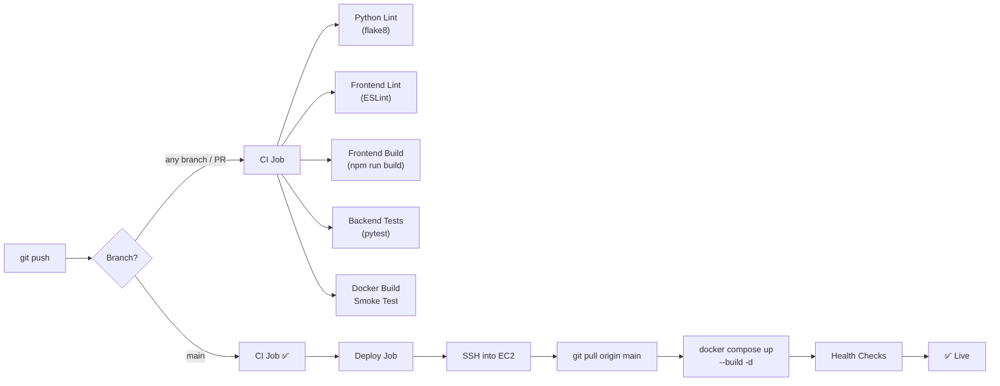

# CI/CD Pipeline for HealthPulse — Auto-Deploy on Git Push

## Overview

Set up a **GitHub Actions** CI/CD pipeline that:
1. **CI (every push & PR)** → Lint, build, test, Docker smoke test
2. **Deploy (push to `main` only)** → SSH into EC2, pull latest code, rebuild & restart containers, verify health



---

## User Review Required

> [!IMPORTANT]
> **GitHub Secrets Required** — You will need to add these secrets in your GitHub repo settings (`Settings → Secrets and variables → Actions → New repository secret`):
> 
> | Secret Name | Value |
> |---|---|
> | `EC2_HOST` | Your EC2 public IP or Elastic IP |
> | `EC2_USERNAME` | `ec2-user` (Amazon Linux) or `ubuntu` (Ubuntu) |
> | `EC2_SSH_KEY` | Full contents of your `.pem` private key file |
> | `EC2_DEPLOY_PATH` | Path to repo on EC2 (e.g. `/home/ec2-user/Healthpulse`) |

> [!WARNING]
> **Elastic IP strongly recommended** — Your EC2 public IP changes when you stop/start the instance. If you don't have an Elastic IP, you'll need to update the `EC2_HOST` secret every time the IP changes. An Elastic IP is free while the instance is running.

> [!CAUTION]
> **SSH Key security** — The `.pem` key is stored as a GitHub encrypted secret. Only repository admins can view/change it. Make sure your EC2 security group restricts SSH (port 22) to GitHub Actions IP ranges or at minimum your IP + GitHub's ranges.

---

## Open Questions

> [!IMPORTANT]
> 1. **Which OS is your EC2 running?** — Amazon Linux 2023 (`ec2-user`) or Ubuntu 22.04 (`ubuntu`)? This determines the SSH username.
> 2. **Do you have an Elastic IP attached?** — If not, I strongly recommend allocating one so the deploy target doesn't change.
> 3. **Where is the repo cloned on EC2?** — Is it at `/home/ec2-user/Healthpulse` or somewhere else?
> 4. **Do you have pytest tests written already?** — If no tests exist yet, I'll add a placeholder test and skip the test step gracefully.

---

## Proposed Changes

### GitHub Actions Workflows

#### [NEW] [ci.yml](file:///c:/Healthpulse/Healthpulse/.github/workflows/ci.yml)

**Continuous Integration** — Runs on every push and pull request to any branch.

**Jobs:**

| Job | Steps | Runs on |
|---|---|---|
| `lint-backend` | Checkout → Python 3.12 → `pip install flake8` → `flake8 healthcare-backend/` | `ubuntu-latest` |
| `lint-frontend` | Checkout → Node 20 → `npm ci` → `npm run lint` | `ubuntu-latest` |
| `build-frontend` | Checkout → Node 20 → `npm ci` → `npm run build` (verify Vite build succeeds) | `ubuntu-latest` |
| `test-backend` | Checkout → Python 3.12 → install requirements + pytest → `pytest` (if tests exist) | `ubuntu-latest` |
| `docker-build` | Checkout → Build backend & frontend Docker images (no push, just verify they build) | `ubuntu-latest` |

All 5 jobs run **in parallel** for speed. If any fails, the PR/commit is marked as failed.

---

#### [NEW] [deploy.yml](file:///c:/Healthpulse/Healthpulse/.github/workflows/deploy.yml)

**Continuous Deployment** — Runs only on push to `main`, after CI passes.

**Steps:**
1. Wait for CI workflow to pass (uses `workflow_run` or `needs`)
2. SSH into EC2 using `appleboy/ssh-action`
3. `cd` to deploy path → `git pull origin main`
4. `docker compose down` → `docker compose up --build -d`
5. Wait 30 seconds for containers to start
6. Run health checks (backend `/api/health`, frontend port 80, n8n `/healthz`)
7. If health checks fail → post failure notification in the workflow summary
8. If health checks pass → ✅ deployment complete

---

### Deployment Scripts

#### [NEW] [scripts/ec2-deploy.sh](file:///c:/Healthpulse/Healthpulse/scripts/ec2-deploy.sh)

A streamlined deployment script designed to be called by GitHub Actions via SSH. Different from the existing `deploy-ec2.sh` (which handles first-time setup). This one:

- Pulls latest code from `main`
- Copies `.env` to `healthcare-backend/`
- Rebuilds and restarts containers with `docker compose up --build -d`
- Runs health checks with retries (up to 60s)
- Exits with non-zero code if health checks fail (so GitHub Actions reports failure)

#### [NEW] [scripts/health-check.sh](file:///c:/Healthpulse/Healthpulse/scripts/health-check.sh)

Standalone health check script with retry logic:
- Checks backend (`localhost:8000/api/health`)
- Checks frontend (`localhost:80`)
- Checks n8n (`localhost:5678/healthz`)
- Retries each up to 10 times with 5s intervals
- Returns clear pass/fail status

---

## One-Time EC2 Setup

Before the pipeline works, you need to do these once on your EC2:

```bash
# 1. Make sure git is installed and the repo is cloned
git clone https://github.com/Telite-systems/Healthpulse.git
cd Healthpulse

# 2. Run the initial deploy to install Docker & set up .env
chmod +x deploy-ec2.sh
./deploy-ec2.sh

# 3. Verify everything is running
docker compose ps
```

After this initial setup, every `git push` to `main` will auto-deploy.

---

## Verification Plan

### Automated Tests (during CI)
- `flake8` linting on Python backend
- `eslint` linting on React frontend  
- `npm run build` to verify the Vite build produces output
- `pytest` for backend unit tests (if they exist)
- `docker build` to verify both Dockerfiles compile successfully

### Deployment Verification
- Health check endpoints validated post-deploy
- GitHub Actions workflow logs show pass/fail
- Failed deployments are clearly reported in the Actions tab

### Manual Verification
After the first push:
1. Push a small change to `main`
2. Watch the Actions tab — CI should run, then Deploy
3. Visit `http://YOUR_EC2_IP` to verify the change is live
4. Check `http://YOUR_EC2_IP:8000/api/health` returns healthy
